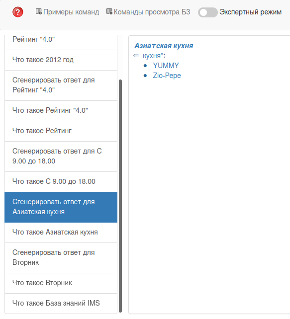

### Agent of finding catering organization by cuisine

The task of this agent is to finding catering organizations which offer defined given argument rrel_1::ui_arg_1.

### Start Working

To launch the agent, we must select as a parameter the cuisine of interest in which we will search for all catering organizations.

Second, press the button """Поиск организаций общественного питания по предлагаемой кухне""" and wait for the response.

#### Work example

**Response:**
