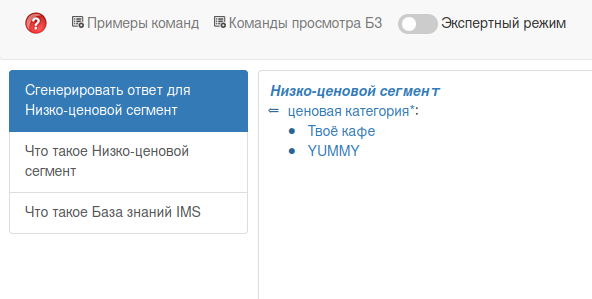

### Agent of finding catering organization by price category

The task of this agent is to finding catering organizations which have price category in given argument rrel_1::ui_arg_1.

### Start Working

To launch the agent, we must select as a parameter the price category of interest in which we will search for all catering organizations.

Second, press the button """Поиск организаций общественного питания по ценовой категории""" and wait for the response.

#### Work example

**Response:**
