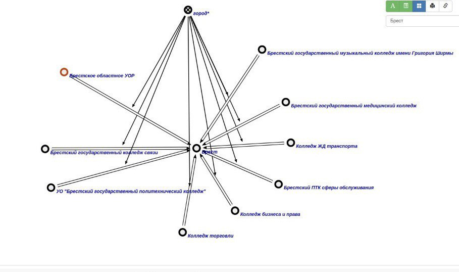

### Agent of finding special secondary schools located in a defined city

The task of this agent is to finding secondary schools which located in a defined given argument rrel_1::ui_arg_1

### Start Working

In order to launch the agent, we must select as a parameter the city of interest in which we will search for all secondary schools 

Second, press the button """Поиск ССУЗ находящееся в опр.городе""" and wait for the response

#### Work example

**Input:**

**Output:**

**GraphVersion:**

