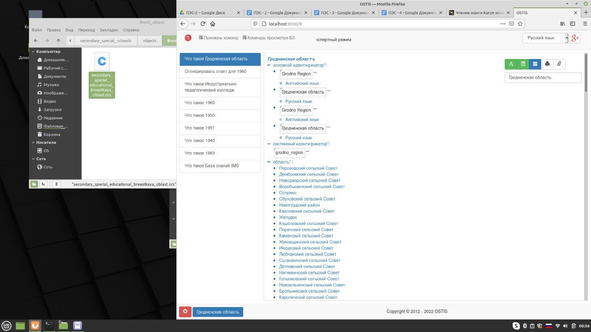
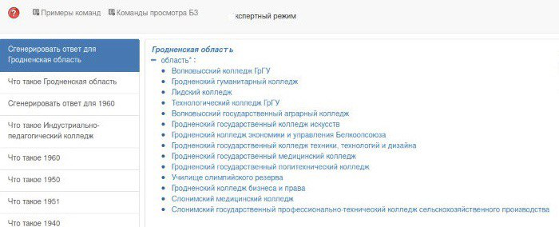
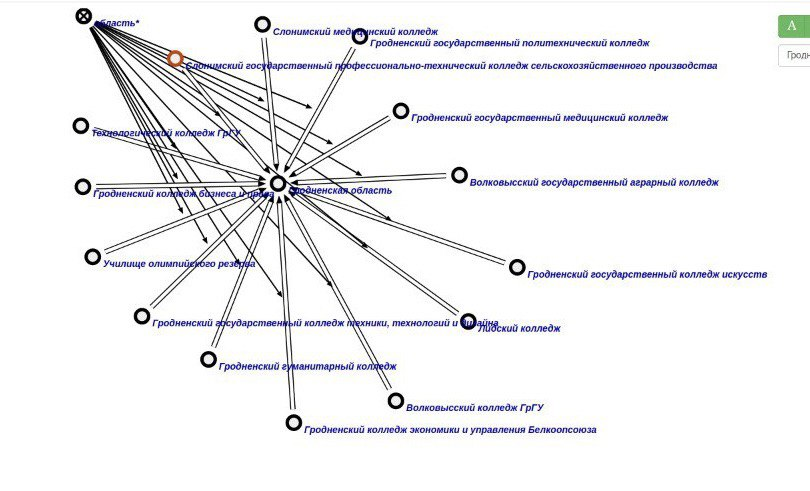

### Agent of finding special secondary schools located in a defined region

The task of this agent is to finding secondary schools which located in a defined given argument rrel_1::ui_arg_1

**Input:**

**Output:**

**GraphVersion:**

