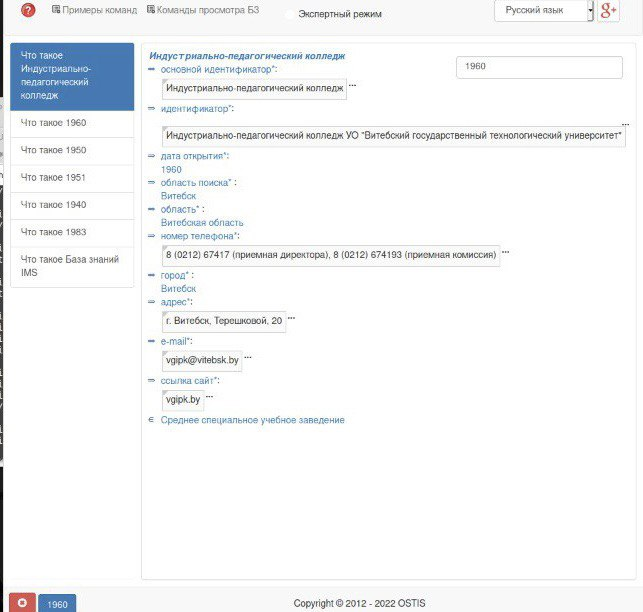

### Agent to find the secondary school by the year of opening of the educational institution

The task of this agent is to find the secondary school by the year of opening of the educational institution given argument rrel_1::ui_arg_1

**Input:**

**Output:**

**GraphVersion:**

