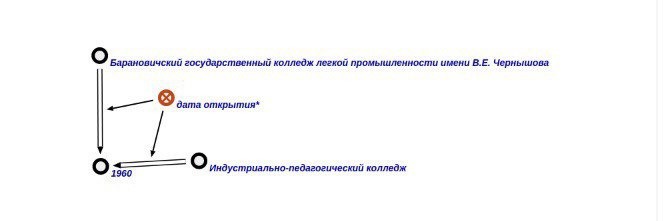

### Agent to find the secondary school by the year of opening of the educational institution

The task of this agent is to find the secondary school by the year of opening of the educational institution given argument rrel_1::ui_arg_1

### Start Working
In order to launch the agent, we must select as a parameter the year in which secondary vocational schools were / were opened on the territory of the Republic of Belarus

Second, press the button """Поиск ССУЗа по году открытия""" and wait for the response

**Input:**

**Output:**

**GraphVersion:**

